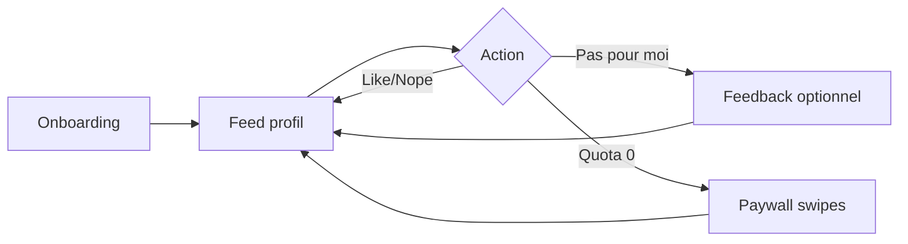

# Résultats de la session de brainstorming

**Facilitateur :** Oliver  
**Date :** 27 mars 2026

## Aperçu de session

**Sujet :** Une application de rencontre dans l’esprit de Tinder (découverte, profils, intérêt mutuel, mise en relation), où le **cœur du matching** est un **algorithme fondé sur l’astrologie**.

**Objectifs :** Explorer comment l’astrologie peut **structurer la compatibilité**, quelles **fonctionnalités et parcours utilisateur** en découlent, et comment **se positionner** (confiance, transparence, plaisir) face aux apps généralistes.

### Contexte

Aucun fichier de contexte projet n’a été fourni ; la session part d’une intention produit claire.

### Mise en place

Paramètres validés avec toi : sujet et objectifs ci-dessus. Approche choisie : **parcours progressif** (large → resserré → action).

## Sélection des techniques

**Approche :** Parcours progressif (exploration → motifs → développement → action)

| Phase | Rôle | Technique |
| ----- | ---- | --------- |
| 1 | Exploration large | **What If Scenarios** |
| 2 | Reconnaissance de motifs | **Mind Mapping** |
| 3 | Développement | **SCAMPER Method** |
| 4 | Plan d’action | **Decision Tree Mapping** |

**En cours :** Phase 3 — *SCAMPER Method* (développer les concepts retenus).

## Phase 1 — Idées capturées (*What If*)

**[Catégorie 1 — Produit / confiance]** : Algorithme « boîte noire »
_Concept_ : Le moteur de compatibilité reste non expliqué en scores ou pourcentages ; il agit sur **qui apparaît** et **quand**, pas sur une étiquette chiffrée.
_Novelty_ : Évite la course au « match 99 % » et le jeu toxique de la métrique, tout en gardant un positionnement astro crédible.

**[Catégorie 2 — Différenciation]** : Surface de signal sans formule
_Concept_ : Montrer à l’utilisateur **quelque chose** de distinctif (story, ambiance, timing, type de lien) **sans** révéler la recette algorithmique — assez pour se démarquer de Tinder, pas assez pour reverse-engineer le modèle.
_Novelty_ : Sépare « transparence marketing / identité » de « transparence technique », ce que les apps généralistes ne font pas proprement.

**[Catégorie 3 — UX possible]** : Narratif plutôt que nombre
_Concept_ : Exemples de signal visible : *pourquoi cette rencontre a du sens ce soir*, *thème du moment*, *lune / saison*, *type de relation suggérée* — en langage symbolique, pas en note.
_Novelty_ : Le feed devient une **expérience de sens** plutôt qu’un classement.

**[Catégorie 4 — Risque à anticiper]** : Équilibre mystère / frustration
_Concept_ : Sans aucun feedback, l’utilisateur peut se sentir perdu ; la « chose indiquée » doit répondre au besoin de **réconfort** et de **légitimité** de l’app sans ouvrir le moteur.
_Novelty_ : Cadre de design pour la phase SCAMPER plus tard (que montrer / quoi taire).

**[Catégorie 5 — Priorité MVP signal]** : Type de lien en premier plan
_Concept_ : Mettre en avant la **qualité / nature du lien** (ex. romantique, amical, intense, léger, exploration…) comme signal principal côté utilisateur — au-dessus du simple « compatible / pas compatible ».
_Novelty_ : Différenciation claire vs Tinder (où l’intention relationnelle est souvent floue ou secondaire).

**[Catégorie 6 — Garniture cosmique]** : Ambiance 3 sans voler la vedette à 5
_Concept_ : Ajouter une **couche d’ambiance** (lune, saison, « climat du moment ») comme **cadre** et plaisir, pas comme score — en soutien du type de lien, pas en concurrence.
_Novelty_ : L’astro reste présente visuellement et émotionnellement sans retomber dans un pourcentage.

**[Catégorie 7 — Monétisation]** : Freemium par usage + visibilité + lieu
_Concept_ : Gratuit avec **swipes limités** ; paiement pour **débloquer des swipes**, **super swipe**, **mise en avant du profil**, **changement de localisation** — aligné sur les habitudes des apps de rencontre, sans verrouiller une « fenêtre de synchro » payante.
_Novelty_ : Revenus prévisibles sans transformer l’astro en paywall mystique sur le moment du match.

**[Catégorie 8 — Cohérence produit]** : Boost vs promesse astro
_Concept_ : Risque à trancher plus tard : le **boost** met en avant un profil pour des raisons « business » (paiement) qui peuvent **court-circuiter** la promesse de matching naturel — à encadrer (badges, transparence « sponsorisé », etc.).
_Novelty_ : Question ouverte utile pour SCAMPER / arbre de décision.

**[Catégorie 9 — Lieu payant]** : Mobilité ciblée
_Concept_ : Payer pour changer de **location** (voyage, déménagement anticipé) — standard marché, mais à connecter à l’algo (nouvelles cartes du ciel / fuseaux) pour rester cohérent avec l’astrologie.
_Novelty_ : Opportunité narrative : « ton ciel à Paris vs Lyon » sans exposer le calcul.

**[Catégorie 10 — Confiance / calibration]** : Feedback sans ouvrir le moteur
_Concept_ : Si le **type de lien** (ou le ressenti) ne correspond pas à l’utilisateur, action du type *« ça ne me correspond pas »* pour **recalibrer ce qui est affiché** (signaux, formulations) — **sans** exposer ni modifier la logique brute de l’algo.
_Novelty_ : Boucle de confiance **produit** (l’app « apprend » ton langage relationnel) distincte d’un simple réglage de filtres à la Tinder.

---

### Fin de phase 1 (synthèse)

Exploration *What If* close : assez de branches pour passer au **regroupement** — phase 2.

## Phase 2 — Mind map (brouillon collaboratif)

**Nœud central :** App de rencontres **matching astro** (flux type Tinder, algo caché).

```
                    ┌─ Signal principal : type de lien (romantique, léger, intense…)
                    │
                    ├─ Garniture : lune / saison / « climat » (émotionnel, pas score)
                    │
App astro ──────────┼─ Algorithme : boîte noire · qui / quand dans le feed · pas de %
                    │
                    ├─ Confiance : feedback « ne me correspond pas » → recalibrage affichage
                    │
                    ├─ Monétisation : gratuit limité · swipes payants · super swipe · boost · lieu
                    │       └─ Tension : boost « sponsorisé » vs promesse naturelle du matching
                    │
                    └─ Risques UX : mystère utile vs frustration · cohérence lieu/fuseau avec le ciel
```

**Axes prioritaires repérés pour la suite (SCAMPER) :** (1) type de lien + (2) boucle de feedback ; (3) encadrer boost ; (4) narratif lieu/ciel.

**Validation :** mind map acceptée telle quelle (choix « 1 ») — phase 2 close.

## Phase 3 — SCAMPER (terminé)

**Objet à faire évoluer :** le **cœur de l’expérience** — *type de lien* visible + *garniture cosmique* + *algo boîte noire* + *feedback* + *monétisation freemium*.

| Lettre | Statut |
| ------ | ------ |
| **S** Substitute | Validé |
| **C** Combine | Validé (A+B+C) |
| **A** Adapt | Validé (4 axes) |
| **M** Modify | Validé (1 oui · 2–4 non) |
| **P** Put to other uses | Validé (roadmap · hors MVP) |
| **E** Eliminate | Validé |
| **R** Reverse | Validé |

### S — Substitute (substituer)

_Qu’est-ce qu’on remplace pour mieux se démarquer de Tinder tout en gardant le modèle mental « swipe / match » ?_

**Pistes à tester (à valider / rejeter avec toi) :**

- Substituer le **% de compatibilité** par un **libellé de dynamique relationnelle** (déjà aligné avec ta vision).
- Substituer « **distance** » comme critère principal par **fenêtre temporelle** ou **qualité de présence** (ex. « même énergie cette semaine ») — reste à décider si tu gardes la distance en arrière-plan.
- Substituer le **boost pur visibilité** par un **boost « alignement »** (mise en avant *parmi* les profils déjà cohérents avec le type de lien) pour réduire la tension avec la promesse astro.

**Décisions utilisateur :**

1. **Oui** — pas de % ; **dynamiques relationnelles** (libellés) à la place du score.
2. **Oui** — la **distance** n’est pas la « star » du feed ; priorité à une **fenêtre / ressenti temporel ou énergétique** ; géo en **arrière-plan**.
3. **Oui** — **boost d’alignement** (visibilité parmi les profils déjà cohérents avec le type de lien), pas un boost « pub » générique.

---

### C — Combine (combiner)

_Quelles fusions créent une fonction ou un parcours unique ?_

**Combinaisons proposées pour discussion :**

- **A.** *Type de lien* + *garniture cosmique* → une **carte de session** (« cette semaine : … · dynamique suggérée : … ») sur chaque profil du feed.
- **B.** *Feedback « ne me correspond pas »* + *recalibrage* → le feedback **affine à la fois** le libellé de dynamique **et** le poids du « climat » affiché (sans exposer l’algo).
- **C.** *Boost alignement* + *lieu payant* → changer de ville **recalcule** le ciel / le contexte ; le boost ne fait que **t’élever dans ce nouveau cadre** aligné, pas au-dessus de tout le monde au hasard.

**Décisions utilisateur :** **oui à tout** — les trois combinaisons **A**, **B** et **C** sont retenues pour la conception.

---

### A — Adapt (adapter)

_S’inspirer d’un modèle qui marche ailleurs, puis l’adapter au matching astro + type de lien._

**Analogies possibles à détourner :**

| D’où | Quoi reprendre | Adaptation « AstroMatch » |
| ---- | ---------------- | ------------------------- |
| **Apps météo** | « ressenti » + **carte du jour** (pas une note unique) | **Carte de session** sur le profil = ton « ressenti relationnel + climat » du moment, pas un score. |
| **Calendriers / cycles** (sport, sommeil) | **fenêtre favorable** | Feed centré sur **quand** et **dans quel climat** une rencontre a du sens — cohérent avec ton S2 (distance secondaire). |
| **E-commerce « recommandations »** | **« pas pour toi »** + raffinement | Proche de ton **B** : feedback qui améliore les suggestions sans afficher la formule. |
| **Places de marché** (boost sponsorisé) | étiquette **« sponsorisé »** / **« mis en avant »** | Pour ton **boost d’alignement** : transparence **« mis en avant parmi les profils alignés »** pour ne pas ressembler à une pub aveugle. |

**Question pour toi :** laquelle de ces **lignes d’adaptation** te semble la plus importante pour le MVP — **météo**, **cycles/fenêtres**, **reco / pas pour toi**, ou **étiquetage boost** ? (Tu peux en choisir **plusieurs** ou dire **« tout sert »** et on garde les quatre comme backlog priorisé plus tard.)

**Décisions utilisateur :** **oui aux quatre** — **météo** (carte / ressenti), **cycles / fenêtres**, **reco e-commerce** (« pas pour toi » + raffinement), **marketplace** (étiquetage boost / mis en avant). Les quatre nourrissent le MVP ; priorisation détaillée possible en phase **Decision Tree** ou backlog.

---

### M — Modify (modifier / amplifier)

_Qu’est-ce qu’on **exagère**, **simplifie** ou **rend plus extrême** pour que l’identité du produit saute aux yeux ?_

**Leviers possibles (à cocher mentalement, on note ensuite) :**

1. **Amplifier** la **carte de session** — occupe **tout le haut** de la carte profil (comme une météo « plein écran » light), pas un petit badge.
2. **Réduire** le bruit **Tinder** — **pas** de compteur de likes global en hero ; métriques sociales **secondaires** ou absentes au début.
3. **Exagérer** le **feedback** — après « pas pour toi », **une micro-animation** ou **une phrase** qui montre que l’app a **entendu** (sans chiffres).
4. **Durcir** la **clarté du boost** — libellé fixe du type : *« Visible parmi les profils dont la dynamique correspond à ta recherche »* (à affiner juridiquement / produit plus tard).

**Décisions utilisateur :**

1. **Oui** — **carte de session** **amplifiée** : occupe le **haut** du profil (style météo « plein écran » light), pas un petit badge.
2. **Non** — garder la **flexibilité** sur compteurs / social proof (pas d’engagement MVP à les retirer du hero).
3. **Non** — pas d’exigence MVP sur **micro-animation / phrase** après feedback (peut rester sobre ou arriver en v2).
4. **Non** — pas de **libellé boost figé** imposé pour l’instant ; à retravailler quand la monétisation sera cadrée.

---

### P — Put to other uses (autres usages)

_Si ce n’était **pas** que des rencontres amoureuses, à quoi d’autre le même moteur pourrait-il servir ?_

**Pistes (pour marque / roadmap / partenariats, pas forcément MVP) :**

- **A.** **Amitié / collocs / duos créatifs** — même logique « dynamique + climat », autre intention.
- **B.** **Mode « atelier »** — groupes ou événements locaux **alignés** sur une fenêtre (sans être un calendrier générique).
- **C.** **API / marque blanche** — ton algo + carte de session pour **médias, coachs, festivals** (B2B).

**Décisions utilisateur :** **tout intéressant mais pas MVP** — **A**, **B** et **C** restent du **potentiel roadmap / marque** ; le MVP reste **centré rencontres** avec le périmètre déjà défini.

---

### E — Eliminate (éliminer)

_Qu’est-ce qu’on **ne fait pas** au MVP pour shipper vite et rester lisible ?_

**Candidats souvent utiles à trancher (oui = on **coupe** du MVP) :**

1. **Explication détaillée de l’algo** (textes longs, glossaire astro complet).
2. **Scores / pourcentages** (déjà exclus — rappel).
3. **Multitudes de modes de relation** au jour 1 (trop de libellés = bruit) — commencer avec **un petit set** de dynamiques.
4. **Fonctions sociales lourdes** (fil d’actu communautaire, groupes intégrés).
5. **Personnalisation cosmique infinie** (toutes les options de maison / aspects avancés dans les réglages dès v1).

**Décisions utilisateur :**

- **Hors MVP :** **(1)** pas de **pédagogie longue / glossaire astro complet** sur l’algo au lancement ; **(4)** pas de **social lourd** (fil communautaire, groupes intégrés).
- **(2)** rappel : **pas de scores / %** — déjà exclu par conception.
- **(3)** tranché : **8 libellés** validés (section dédiée).
- **(5)** tranché pour le MVP : périmètre **E5** ci-dessous (**données minimales** + **pas** de réglages cosmiques avancés au lancement).

---

### R — Reverse (inverser)

_Et si l’hypothèse inverse était vraie ?_ — test rapide pour éviter les angles morts.

**Provocations (réponds par celle(s) qui mérite(nt) d’être gardée(s) comme « risque produit » ou « idée ») :**

1. **Et si** il n’y avait **pas de swipe** — uniquement une **liste ordonnée** par fenêtre / climat ?
2. **Et si** l’astro n’était **pas** dans le matching mais **uniquement** dans la **carte de session** (matching autre chose) ?
3. **Et si** le **payant** n’était **pas** les swipes mais **l’accès** à certains **types de dynamique** ou **lieux** ?

**Décisions utilisateur :**

- **(2)** *Astro uniquement en carte de session, matching sur autre chose* — **intéressant, plus tard** (piste **roadmap / variante produit**, pas le MVP actuel qui centre l’astro dans le matching).
- **(1)** liste sans swipe · **(3)** monétisation par dynamique/lieu — **non tranchés** ici ; restent en **exploration** si besoin.

---

## Phase 4 — Decision Tree (plan de décisions MVP)

**Objectif :** enchaîner les **décisions** dans un ordre qui débloque design + tech sans tout mélanger.

```
Démarrer MVP
    │
    ├─► [A] Nature du signal principal ?
    │       └─► DYNAMIQUE DE LIEN + carte session (garniture cosmique) — validé
    │
    ├─► [B] Algo visible ?
    │       └─► Boîte noire · pas de % — validé
    │
    ├─► [C] Feed : distance ?
    │       └─► Secondaire · fenêtre / climat prioritaires — validé
    │
    ├─► [D] Monétisation ?
    │       └─► Freemium swipes + super swipe + boost alignement + lieu payant — validé
    │       └─► Hors MVP : pas de pédagogie longue (1) · pas de social lourd (4)
    │
    ├─► [E] UI carte session ?
    │       └─► Amplifiée en haut de profil — validé (M)
    │
    └─► [F] Roadmap explicite ?
            ├─► P : autres usages (A/B/C) — plus tard
            ├─► R2 : matching non-astro + astro purement carte — plus tard
            └─► **Libellés dynamique** — **8 validés** · **réglages astro (E5)** — périmètre MVP défini (section E5)
```

**Prochaines actions suggérées (hors brainstorming) :**

1. **Produit** — ~~figer **5–8 libellés**~~ **fait** : **8 libellés** validés tels quels (tableau ci-dessous).
2. **Design** — wireframes textuels **MVP** (section dédiée) — à passer en maquettes Figma / code.
3. **Tech / data** — ~~liste minimale~~ **cadrée** dans la section **E5** (naissance + lieu + fuseau ; option heure inconnue).
4. **Monétisation** — **grille de principe** (section dédiée) — **prix** à fixer (marché, pays, stores) ; **libellés** juridiques / store à valider avant release.

**Statut phase 4 :** arbre posé — **libellés dynamique MVP validés** (voir ci-dessous).

---

## MVP — Libellés de dynamique (**validés** — 8)

_Objectif :_ petit ensemble **lisible** pour le feed et la carte de session ; **pas** de sous-variants par libellé au MVP (ça viendra si besoin).

| # | Libellé (UI) | Ce qu’on suggère (1 phrase) |
|---|----------------|-----------------------------|
| 1 | **Romance** | Tendresse, complicité douce, envie de **faire durer**. |
| 2 | **Intensité** | Magnétisme fort, **émotions vives**, rythme plus rapide. |
| 3 | **Léger** | Flirt, fun, **peu de pression** sur la suite. |
| 4 | **Construire** | Stabilité, **projets** (vie, lieux), vision long terme. |
| 5 | **Complicité** | **Amitié** et confiance d’abord ; la romance si ça colle. |
| 6 | **Au feeling** | **Ouvert** — voir ce qui naît sans cadre fixe. |
| 7 | **Sérieux** | Intentions **claires** ; moins de jeux ambigus. |
| 8 | **Aventure** | Imprévu, **déplacements**, spontanéité (même écran « voyage »). |

**Usage produit typique :**

- L’utilisateur choisit **1 à 2** dynamiques **recherchées** à l’onboarding (ou plus tard dans les réglages).
- Chaque profil du feed affiche **une dynamique suggérée** (issue du moteur + carte session), pas un score.
- Le feedback **« ça ne me correspond pas »** peut **réorienter** le vocabulaire affiché ou le poids des suggestions (sans exposer l’algo).

**Validation utilisateur :** **acceptés tels quels** — Romance, Intensité, Léger, Construire, Complicité, Au feeling, Sérieux, Aventure (définitions du tableau ci-dessus).

---

## MVP — Données & réglages astro (**E5**)

Aligné avec **pas de glossaire long**, **pas de personnalisation cosmique infinie** au lancement.

### Données minimales pour le moteur (profil utilisateur)

| Donnée | MVP | Note |
| ------ | --- | ---- |
| **Date de naissance** | Oui | Jour / mois / année. |
| **Heure de naissance** | Recommandée | Si inconnue : choix explicite **« je ne sais pas »** → règle produit à fixer en implémentation (ex. midi local, ou thème sans maisons détaillées) — **sans** exposer la méthode dans un long texte. |
| **Lieu de naissance** | Oui | Ville / point sur carte + **pays** pour fuseau et coordonnées. |
| **Fuseau / DST** | Déduit | Automatique à partir du lieu + date ; pas d’écran « expert » au MVP. |
| **Lieu actuel** (feed, lieu payant) | Oui | Déjà prévu pour géo en arrière-plan + **recalcul** contexte si changement de ville payant. |

### Réglages « astro » visibles au MVP

- **Uniquement l’essentiel :** correction ou saisie **naissance** (date / heure / lieu) ; **lieu actuel** ; éventuellement **préférence de dynamiques** (1–2 libellés) — déjà couvert ailleurs.
- **Pas au MVP :** choix de **système de maisons**, liste d’**aspects** à la carte, **astéroïdes**, orbes, **thème secondaire** (transit du jour comme produit séparé), etc. → **roadmap** ou v2.

### Confidentialité (rappel)

- **Courte** notice (consentement, usage des données de naissance pour le matching, pas de vente détaillée type pédagogie E1).
- Pas de **page glossaire** astro dans l’app au lancement.

**Décision :** périmètre **E5** ci-dessus **accepté** suite à ton **« oui »** pour trancher cette zone (aligné avec les exclusions **1** et **5** du SCAMPER **E**).

---

## MVP — Wireframes (textuels)

But : guider **design / dev** sans figma ici — blocs **de haut en bas**, **gauche / droite** pour le swipe.

### 1. Onboarding (séquence suggérée)

```
┌─────────────────────────────────────┐
│  Logo · titre · 1 phrase promesse   │
│  [Continuer]                        │
└─────────────────────────────────────┘
          ↓
┌─────────────────────────────────────┐
│  Naissance : date · heure · lieu    │
│  [ ] Je ne connais pas mon heure     │
│  [Suivant]                          │
└─────────────────────────────────────┘
          ↓
┌─────────────────────────────────────┐
│  Tu cherches plutôt… (max 2)         │
│  [ grille des 8 libellés ]          │
│  [Suivant]                          │
└─────────────────────────────────────┘
          ↓
┌─────────────────────────────────────┐
│  Où es-tu en ce moment ? (carte)   │
│  [Activer la géoloc] [Saisir ville] │
│  [Entrer dans l’app]                │
└─────────────────────────────────────┘
```

### 2. Feed — carte profil (cœur produit)

**Contrainte :** **carte de session** = **zone dominante en haut** (style « météo »), puis le reste type app de rencontres.

```
┌─────────────────────────────────────┐
│ ┌─────────────────────────────────┐ │
│ │ CARTE DE SESSION (pleine largeur)│ │
│ │ · climat / lune / saison (court) │ │
│ │ · dynamique suggérée : « Léger » │ │
│ │ · ligne optionnelle : fenêtre /   │ │
│ │   « ouvert cette semaine »        │ │
│ └─────────────────────────────────┘ │
│  [Photo 1]          · · · (carousel) │
│  Prénom, âge                        │
│  Ville · distance (secondaire)      │
│  Bio courte…                        │
│                                     │
│  [ ← Nope ]    [ ★ Super ] [ Like → ]│
│  [ Ça ne me correspond pas ]        │
└─────────────────────────────────────┘
```

### 3. Feedback « Ça ne me correspond pas »

```
┌─────────────────────────────────────┐
│  Qu’est-ce qui cloche ? (optionnel) │
│  ○ La dynamique affichée             │
│  ○ Le profil en général              │
│  [Envoyer] [Annuler]                │
└─────────────────────────────────────┘
```

_Action attendue côté produit :_ recalibrage affichage **sans** promettre un délai ni montrer l’algo.

### 4. Fin de quota swipes (gratuit)

```
┌─────────────────────────────────────┐
│  Plus de swipes aujourd’hui          │
│  [ Voir les offres ]   [ Fermer ]   │
└─────────────────────────────────────┘
```

### 5. Écran boutique / monétisation (vue d’ensemble)

Voir section **Monétisation** ci-dessous ; même structure : **liste d’achats** + rappel court du **boost d’alignement**.

### Flux (aperçu)



---

## MVP — Monétisation (grille de principe)

**Principes rappelés :** gratuit **limité en swipes** ; achats **swipes** / **super swipe** / **boost d’alignement** / **changement de lieu** ; **pas** de libellé boost figé imposé avant cadrage juridique — formulations **indicatives** ci-dessous.

### Paliers indicatifs (à adapter pays / store)

| SKU | Description produit | Rôle |
| --- | ------------------- | ---- |
| **Gratuit** | X swipes / jour (X = **à définir** : ex. 15–30) | Acquisition + habitude |
| **Pack swipes** | +N swipes **non expirants** ou **24h** (choix produit) | Revenue principal court terme |
| **Super swipe** | Mise en évidence **d’un** like (visibilité accrue côté reçu) | Optionnel MVP si complexité — sinon v1.1 |
| **Boost alignement** | Visibilité **prioritaire parmi les profils déjà dans le même type de dynamique / alignement** (pas toute la base) | Différenciation vs Tinder Boost « brut » |
| **Pass lieu** | Débloquer **changement de ville** ou **zone** pour une durée T | Recalcule contexte ciel + feed |

**Formulation client (brouillon — à valider juridiquement) :**

- Boost : *« Mise en avant parmi les profils dont la dynamique correspond à ce que tu cherches »* (ou équivalent court).
- Lieu : *« Explorer une autre ville : ton contexte et tes suggestions sont mis à jour »*.

### Prix (placeholder)

| Article | Prix indicatif | Note |
| ------- | --------------- | ---- |
| Pack petit (ex. +20 swipes) | **TBD €** | A/B test |
| Pack moyen | **TBD €** | Meilleur €/swipe |
| Super swipe (unité) | **TBD €** | Souvent micro-prix |
| Boost alignement (durée TBD min) | **TBD €** | Comparer aux concurrents |
| Pass lieu (7 j / 30 j) | **TBD €** | Récurrent possible plus tard |

### Règles à trancher avant build paiement

1. **Swipes** : reset **quotidien** vs **roulement** ; timezone utilisateur.
2. **Boost** : durée d’effet, **cooldown**, file d’attente si plusieurs boosts (MVP : règle simple).
3. **Lieu** : nombre de changements inclus dans le pass ; anti-abus (VPN / spoofing) — hors scope brainstorming, à traiter en tech.
4. **Stores** : conformité **Apple / Google** sur abonnements vs consommables (selon choix produit : tout achat in-app **one-shot** au MVP ou **abo** plus tard).

---

**Statut :** wireframes + grille monétisation **validés tels quels** par toi — **prix** et **règles stores** restent à fixer hors brainstorming.

**Validation utilisateur :** conservation **sans modification** du contenu des sections **Wireframes** et **Monétisation** (session courante).
