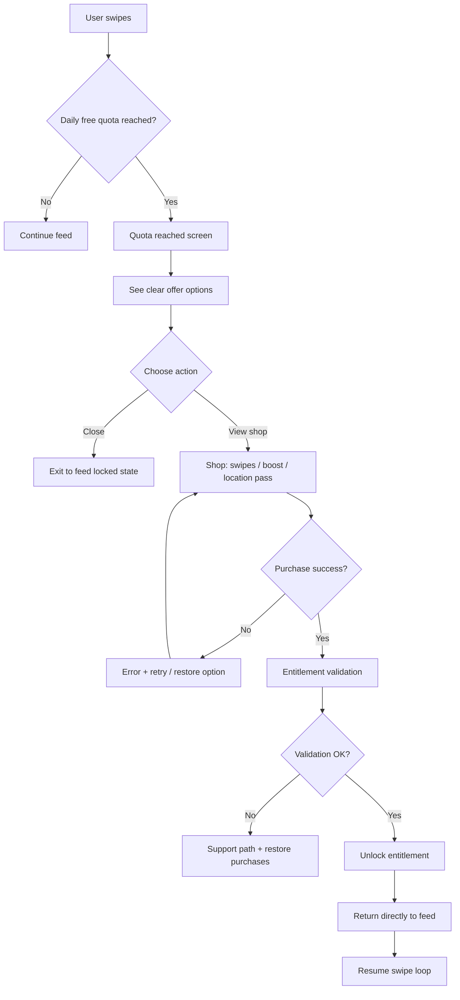

---
stepsCompleted:
  - 1
  - 2
  - 3
  - 4
  - 5
  - 6
  - 7
  - 8
  - 9
  - 10
  - 11
  - 12
  - 13
  - 14
lastStep: 14
inputDocuments:
  - "_bmad-output/planning-artifacts/prd.md"
  - "_bmad-output/brainstorming/brainstorming-session-2026-03-27-002226.md"
---

# UX Design Specification astromatch

**Author:** Oliver
**Date:** 2026-03-27

---

## Visual inspiration (non-binding)

These images are **directional only**—mood, composition, and tone. They are **not** locked UI specs; final screens follow the design system and implementation.

### Reference 1


### Reference 2


### Reference 3


<!-- UX design content will be appended sequentially through collaborative workflow steps -->

## Executive Summary

### Project Vision

astromatch is a consumer mobile dating app that keeps the matching engine opaque while foregrounding relationship dynamics and a session card, a weather-style, full-width hero on each profile that blends short cosmic context (mood, moon/season, timing) with a suggested dynamic from a fixed set of eight MVP labels. The experience deliberately avoids public percentage compatibility, replacing it with meaning-first language and a product-level calibration loop via "doesn't match me" feedback. Monetization follows familiar freemium patterns (daily swipe limits, packs, alignment boost, location pass) with clear, non-mystical commerce copy aligned to store and trust expectations.

### Target Users

Primary users are adults seeking intentional dating, people tired of volume-first apps and gamey compatibility metrics, who are open to astrology as depth and framing rather than as a scoreboard. They may be skeptical or curious; they are not expected to be astro experts. They use smartphones (iOS/Android), often in short sessions; some will deny location and must complete onboarding and feed context via manual city entry without penalty.

### Key Design Challenges

- Signal without the formula: communicate enough narrative legitimacy through the session card and dynamics so the feed feels coherent, not random, without exposing or editing raw matching rules.
- Mystery vs frustration: balance black-box ordering with actionable feedback ("doesn't match me") and honest copy, with no fake precision or mystical paywalls.
- Trustworthy monetization: present quota, packs, alignment boost, and location pass with transparent labeling (especially boost scope) that does not undermine the brand promise.
- Sensitive data UX: smooth birth place entry and correction, optional unknown birth time, and privacy/consent surfaces that feel respectful, not alarming.
- Mobile execution: a dominant top session card plus standard dating patterns (photos, bio, swipe actions) must remain readable, accessible, and performant on common devices.

### Design Opportunities

- Session card as hero: own a distinctive "relationship weather" visual and interaction pattern competitors do not offer.
- Dynamics as shared vocabulary: eight validated labels give clarity of intent at a glance and support both onboarding choices and feed presentation.
- Calibration loop: a lightweight mismatch path can increase trust and retention without advanced settings or astro pedagogy at MVP.
- Location-flexible onboarding: treating manual city as a first-class path supports completion parity when geolocation is off.

## Core User Experience

### Defining Experience

The core of astromatch is a high-frequency, low-friction swipe loop where users quickly evaluate profiles through a distinct top-of-card session card and then decide (pass / like / super-like). The product's value depends on making this loop feel intentional rather than random: users should understand the relational context fast, act confidently, and keep momentum.

### Platform Strategy

astromatch is designed as a mobile-first product with equal priority for iOS and Android from day one. Interactions are touch-native, optimized for card browsing and gesture-driven decisions. Offline support should include cached viewing and queued user actions where feasible, with clear sync/retry feedback when connectivity returns.

### Effortless Interactions

- Reading the session card must be immediate and cognitively light (one-glance comprehension).
- Swipe decisions must feel fast and interruption-free.
- Transition between cards should preserve rhythm and reduce decision fatigue.
- Core actions should require minimal taps and no extra interpretation.
- Network/state handling should be mostly automatic, with lightweight feedback only when needed.

### Critical Success Moments

- The key "this is better" moment is the first meaningful match.
- First-time value should appear within the initial feed session through coherent card/profile context.
- The make-or-break risk is a prolonged "no match" experience, which can quickly break trust and retention.
- If users cannot perceive progress toward meaningful matching, core product value collapses.

### Experience Principles

- Prioritize swipe flow continuity over feature density.
- Make session-card comprehension instant before asking for action.
- Optimize for meaningful-match momentum, not raw profile volume.
- Keep cross-platform parity (iOS/Android) for core flows from launch.
- Reduce friction automatically (caching, queueing, recovery) before asking users to troubleshoot.

## Desired Emotional Response

### Primary Emotional Goals

astromatch should make users feel understood first: seen for the kind of relationship dynamic they seek, not reduced to generic swiping patterns. The product should also sustain excitement through discovery, while keeping emotional intensity grounded in clarity and trust.

### Emotional Journey Mapping

- First discovery: users feel curious and intrigued, with enough clarity to trust the experience quickly.
- Core swipe experience: users feel understood and emotionally guided, not overwhelmed by random volume.
- After session (with or without match): users should feel "I was seen" and that the app reflects their intent.
- When something goes wrong (especially no-match periods): the target emotional fallback is courage - users feel encouraged to continue rather than discouraged.
- Return usage: users feel motivated to come back because the experience still feels personally relevant.

### Micro-Emotions

Most critical micro-emotional balances for astromatch:

- Excitement vs anxiety: keep discovery energizing without making outcomes feel stressful or unpredictable.
- Accomplishment vs frustration: ensure users feel progress and agency even when immediate outcomes (e.g., match) are not guaranteed.
- Belonging vs isolation: reinforce that users are not "missing out," but participating in a context that can fit them.

### Design Implications

- Understood -> prioritize one-glance session-card clarity and coherent relationship-dynamic labeling; avoid noisy or contradictory signals.
- Excited -> preserve swipe rhythm, smooth transitions, and emotionally warm micro-copy that keeps momentum.
- Seen / courage during no-match -> add supportive empty/no-match states, gentle progress framing, and non-judgmental guidance to continue.
- Trust over skepticism -> keep promise-language honest (especially around matching and monetization), avoid fake precision or manipulative urgency.
- Belonging over isolation -> use inclusive tone, reassuring defaults, and clear feedback loops ("doesn't match me" meaningfully influences experience over time).

### Emotional Design Principles

- Design for emotional safety plus forward momentum in every session.
- Make users feel personally recognized before asking for repeated action.
- Convert uncertainty into courage, not pressure.
- Reward engagement with perceived relevance, not just activity volume.
- Protect trust through transparent, non-mystical language across core and paid flows.

## UX Pattern Analysis & Inspiration

### Inspiring Products Analysis

**WhatsApp**

- Solves fast, low-friction communication with extremely clear conversation-first hierarchy.
- Onboarding is minimal and direct; users reach core value quickly.
- Strengths: reliability cues (delivery/read states), predictable navigation, lightweight media sharing.
- Retention driver: high trust in message continuity and instant response loops.

**Instagram**

- Solves lightweight social discovery with strong visual-first presentation and high content scannability.
- Strengths: fast feed consumption, familiar interaction language, progressive disclosure from feed to detail.
- Retention driver: repeated short-session engagement and emotionally rewarding visual rhythm.

**Tinder**

- Solves rapid people discovery with a highly optimized swipe loop and immediate decision mechanics.
- Strengths: one-card focus, simple binary actions, low cognitive load in the core loop.
- Retention driver: anticipation/reward cycle around matches and momentum through quick card progression.

### Transferable UX Patterns

**Navigation Patterns**

- Conversation-first and feed-first top-level structures (WhatsApp/Instagram) can map to astromatch's match/chat and profile feed architecture.
- Minimal navigation depth for high-frequency actions supports rapid session value.

**Interaction Patterns**

- Tinder-style one-card-at-a-time decision flow aligns with astromatch's core swipe loop.
- WhatsApp-like message clarity (state visibility, predictable entry points) should guide post-match messaging UX.
- Instagram-style quick visual scanning supports profile readability before decision.

**Visual Patterns**

- Strong hero area per card (inspired by feed-first apps) maps directly to astromatch's session-card-as-hero concept.
- Clear typographic hierarchy and short text blocks support one-glance comprehension of dynamics/context.
- Motion should support momentum (smooth transitions), not distract from decision-making.

### Anti-Patterns to Avoid

- Infinite novelty without perceived progress (common feed fatigue risk): conflicts with astromatch's meaningful-match momentum goal.
- Overloaded profile cards with too many simultaneous signals: increases anxiety and decision fatigue.
- Dark-pattern urgency or manipulative monetization messaging: undermines trust, especially in astrology-driven positioning.
- Ambiguous no-match states with no encouragement or framing: amplifies frustration and churn.
- Complex settings-heavy personalization upfront: conflicts with understood quickly emotional goal.

### Design Inspiration Strategy

**What to Adopt**

- Tinder's low-friction swipe mechanics for core decision speed.
- WhatsApp's clarity and reliability cues for chat and communication trust.
- Instagram's visual scanning rhythm for profile/media readability.

**What to Adapt**

- Replace generic swipe context with astromatch's session card and dynamic labels as primary meaning layer.
- Reframe retention loops from pure novelty to perceived relevance and "I was seen."
- Adapt feed pacing to prioritize coherent matches over raw volume.

**What to Avoid**

- Engagement loops that feel addictive but emotionally empty.
- Monetization copy that feels mystical, vague, or manipulative.
- Interface clutter that competes with the session card and weakens comprehension.

This strategy uses proven interaction patterns while preserving astromatch's unique positioning: intentional dating through narrative compatibility, not score-chasing.

## Design System Foundation

### 1.1 Design System Choice

For astromatch, we choose a themeable design system approach as the foundation (brand-customizable components on top of a proven UI framework).

### Rationale for Selection

- Uniqueness first: astromatch needs a distinctive emotional identity (session-card hero, "relationship weather" tone, intentional-dating positioning) that cannot feel generic.
- Speed second: a themeable foundation accelerates MVP delivery with ready patterns/components while avoiding full from-scratch UI cost.
- Maintenance third: using established primitives and tokens reduces long-term complexity compared with a fully custom design system.
- Cross-platform fit: this approach supports day-1 iOS/Android parity with shared interaction rules and brand-consistent theming.
- Risk control: preserves flexibility for brand evolution without locking the team into brittle one-off components.

### Implementation Approach

- Start from a mature, themeable component foundation aligned with mobile product architecture.
- Define core design tokens early: color roles, typography scale, spacing, radius, elevation, motion, and state semantics.
- Build the MVP around a small, high-impact component set:
  - Session Card (hero)
  - Profile Card + media carousel primitives
  - Swipe action controls and state feedback
  - Mismatch feedback modal/sheet
  - Quota/paywall and offer cards
  - Match/chat list and message primitives
- Use composition over heavy customization: prefer extending primitives with tokens/variants instead of rewriting base behavior.
- Add accessibility and interaction standards as non-optional constraints (contrast, touch targets, type scaling, motion reduction).

### Customization Strategy

- Brand layer: apply astromatch identity via tokens and semantic styles (not ad-hoc per-screen overrides).
- Experience layer: reserve custom interaction design for differentiators (session-card hierarchy, emotional copy rhythm, no-match encouragement states).
- Component governance: define rules for when to create a new component vs extend an existing one.
- Consistency guardrails: maintain naming conventions, variant logic, and reusable patterns across onboarding, feed, monetization, and chat.
- Evolution path: ship lean MVP tokens/components first, then expand system depth after validation (not before).

## 2. Core User Experience

### 2.1 Defining Experience

The defining astromatch experience is: users quickly understand relational context from a session card, swipe with confidence, and get better-quality matches over time. In user language, this is "astromatch gives you better matches," not by showing scores, but by making each profile feel more relevant and intentional.

### 2.2 User Mental Model

Users arrive with a familiar dating-app mental model (fast swipe decisions), and also a visual-scanning habit from social feeds. astromatch should leverage both:

- familiar one-card swipe rhythm for low-friction decisions
- strong visual hierarchy for rapid context intake
- minimal cognitive overhead before action

Likely confusion points to proactively prevent:

- not understanding what the session card means
- feeling randomness when no match happens quickly
- misreading "better match" as guaranteed outcomes

### 2.3 Success Criteria

Core experience success is measured by:

- Time-to-first meaningful swipe: users reach confident first actions quickly.
- Session card comprehension: users understand the card's meaning at a glance.
- Match conversion: meaningful swipe behavior translates into real match outcomes.

Operational success signals:

- users maintain swipe momentum without hesitation
- fewer abandoned sessions after initial card exposure
- stable progression from card understanding -> swipe decision -> match opportunity

### 2.4 Novel UX Patterns

This experience is mostly novel, delivered through a familiar interaction shell.

- Established layer: swipe mechanics and feed navigation users already know.
- Novel layer: session-card-led relational context as the decision anchor (instead of numeric compatibility).
- Innovation strategy: combine known interaction patterns with a new meaning layer, so users do not need to learn new mechanics to benefit from new value.

### 2.5 Experience Mechanics

**1) Initiation**

- User opens feed and lands directly on a profile with a prominent session card.
- The card invites quick interpretation before any swipe action.

**2) Interaction**

- User scans session card + key profile signals.
- User acts with pass / like / super-like (and optional mismatch feedback).
- System advances instantly to preserve rhythm.

**3) Feedback**

- Immediate visual/action confirmation after each swipe.
- If no-match periods persist, show both:
  - encouragement copy (emotional support + momentum framing)
  - context tweak cues (signals that relevance is being recalibrated)

**4) Completion**

- Successful micro-completion: user feels each decision was informed and intentional.
- Successful macro-completion: user reaches meaningful matches with perceived quality.
- Next step naturally loops back into the feed with improved relevance expectations.

## Visual Design Foundation

### Color System

No fixed brand guideline exists yet, so astromatch adopts a custom foundation built from the selected direction: Option A palette (Cosmic Calm) with a smooth, non-aggressive visual tone.

**Core palette**

- Primary: `#6C5CE7` (deep violet)
- Secondary: `#14B8A6` (teal)
- Accent: `#F59E0B` (warm highlight)
- Background: `#0F1020`
- Surface: `#17192E`
- Text primary: `#F8FAFC`
- Text muted: `#AAB1C5`

**Semantic mapping**

- Primary action / key emphasis: violet scale (primary)
- Supportive / contextual states: teal scale (secondary)
- Positive momentum highlights: warm accent used sparingly
- Error: soft red (to be defined in token set)
- Warning: amber family aligned with accent
- Success: muted green/teal variant (to avoid visual aggression)

**Visual behavior**

- Favor soft gradients, controlled contrast transitions, and low-harshness glow.
- Avoid saturated neon overload or alarm-like states in core flows.
- Keep emotional tone reassuring and intentional.

### Typography System

Typography follows a modern, clarity-first tone (inspired by Option C), while preserving warmth in key moments.

**Font strategy**

- Primary UI font: `Inter` (high legibility, fast scanning)
- Accent/display option: `Space Grotesk` only for selected hero moments (e.g., session-card title), used sparingly
- Fallback: `Inter, system-ui, -apple-system, Segoe UI, Roboto, sans-serif`

**Type scale (mobile-first)**

- Display: 32/38
- H1: 28/34
- H2: 24/30
- H3: 20/26
- Body L: 16/24
- Body M: 14/20
- Caption: 12/16

**Tone rules**

- Keep copy compact and calm.
- Prefer medium weights over heavy bold blocks.
- Preserve hierarchy clarity without aggressive contrast jumps.

### Spacing & Layout Foundation

The layout system prioritizes smooth rhythm and cognitive ease in swipe-heavy flows.

**Spacing tokens**

- Base unit: `8px`
- Scale: `4, 8, 12, 16, 24, 32, 40, 48`

**Layout principles**

- One dominant focal zone: session card at top of profile.
- One clear action zone: swipe controls and key CTA area.
- Medium-airy density: enough breathing room without reducing information pace.
- Rounded geometry: primary radius `16`, secondary `12` for soft visual language.

**Interaction smoothness**

- Motion should feel gliding, not snappy-aggressive.
- Use subtle transitions to maintain momentum.
- Keep gesture feedback immediate but visually gentle.

### Accessibility Considerations

- Meet at least WCAG AA contrast targets (`4.5:1` for body text, `3:1` for large text/icons).
- Do not encode status by color alone; pair with labels/icons.
- Respect OS text scaling and reduced-motion preferences.
- Ensure minimum touch targets (`44x44`) for key actions.
- Keep session-card readability stable across backgrounds (overlay control, contrast-safe text colors).

## Design Direction Decision

### Design Directions Explored

The team explored six visual directions in the generated showcase (`ux-design-directions.html`) with variation across hierarchy, density, narrative emphasis, and action-zone weight. The final preference is a hybrid that combines:

- Direction 1: Balanced Hero layout structure
- Direction 3: Warm Accent Pulse emotional color usage
- Direction 4: Expanded Session Story narrative treatment

### Chosen Direction

**Chosen Direction: Hybrid (1 + 3 + 4)**

**Core characteristics**

- Balanced, readable card hierarchy as the default scaffold.
- Session card remains the dominant top focus, with expanded narrative context.
- Warm accent is applied selectively to reinforce encouragement, momentum, and "seen" moments.
- Overall tone stays smooth, calm, and non-aggressive, aligned with emotional goals.

**Design decisions locked**

- Keep medium-airy density from the balanced layout.
- Preserve larger story-capable session card from expanded narrative direction.
- Use accent pulses only for meaningful states (momentum cues, supportive feedback), not constant visual noise.
- Maintain clear separation between context area (session card) and action area (swipe controls).

### Design Rationale

This hybrid best supports astromatch's product promise ("better matches through meaningful context") while protecting usability:

- Clarity: balanced hierarchy reduces cognitive load in the swipe loop.
- Differentiation: expanded session storytelling creates a recognizable product signature.
- Emotion: warm accent pulse supports courage/excitement without becoming visually aggressive.
- Trust: calm visual rhythm reinforces intentionality over gimmick-style engagement.
- Scalability: the structure adapts cleanly from onboarding to feed, no-match states, and match/chat continuity.

### Implementation Approach

- Start implementation with Direction 1 layout primitives as baseline components.
- Integrate Direction 4 narrative treatment in session-card variants (short, medium, extended context states).
- Apply Direction 3 accent behavior as semantic tokens and interaction states (not hardcoded one-off colors).
- Define guardrails:
  - max narrative text length per session card
  - accent usage limits per screen
  - contrast-safe overlays for hero readability
- Build and test first on feed/profile card flow, then propagate to related surfaces (mismatch modal, quota state, match handoff).

## User Journey Flows

### Onboarding to First Meaningful Swipe

Goal: get users from install to a confident first swipe with clear intent and zero dead ends (including location denied and unknown birth time paths).

```mermaid
flowchart TD
  A[Open app] --> B[Create account / sign in]
  B --> C[Enter birth date]
  C --> D{Birth time known?}
  D -->|Yes| E[Enter birth time]
  D -->|No| F[Select "I don't know"]
  E --> G[Birth place search + select]
  F --> G
  G --> H{Location permission granted?}
  H -->|Yes| I[Use device location]
  H -->|No| J[Manual city entry]
  I --> K[Select up to 2 dynamics]
  J --> K
  K --> L[Privacy + consent confirmation]
  L --> M[Enter feed]
  M --> N[See first session card + profile]
  N --> O{Understands session card?}
  O -->|Yes| P[First meaningful swipe]
  O -->|No| Q[Inline helper microcopy]
  Q --> P
  P --> R[Continue swipe loop]
```

Flow notes:

- Unknown birth time and denied geolocation are first-class paths, not error states.
- Session-card comprehension support appears inline before first action.
- Success is first confident swipe, not just completion of forms.

### Core Swipe Loop + Mismatch Feedback Recalibration

Goal: preserve swipe momentum while giving users a low-friction way to improve relevance when "this doesn't match me."

```mermaid
flowchart TD
  A[Feed card displayed] --> B[Read session card]
  B --> C[Swipe: pass / like / super-like]
  C --> D{Mutual match?}
  D -->|Yes| E[Match notification]
  E --> F[Open chat or continue feed]
  D -->|No| G[Next card]
  G --> H{User feels mismatch?}
  H -->|No| A
  H -->|Yes| I[Tap "Doesn't match me"]
  I --> J[Choose reason: dynamic vs profile]
  J --> K[Submit feedback]
  K --> L[Show encouragement + "we'll tune this"]
  L --> M[Adjust weighting/presentation signals]
  M --> N[Serve next cards with updated relevance]
  N --> A
```

Flow notes:

- Mismatch flow is optional and lightweight.
- Immediate response combines emotional reassurance and confidence cue.
- Recalibration is system-side and opaque; no algorithm exposure.

### Quota Hit to Purchase and Return to Feed

Goal: convert without trust loss; keep monetization clear, non-mystical, and reversible where possible.



Flow notes:

- Copy remains explicit and benefit-based, never mystical.
- Purchase validation and restore are visible reliability safeguards.
- Return-to-feed is immediate to preserve momentum after payment.

### Journey Patterns

**Navigation patterns**

- Feed-first default with minimal branching.
- Bottom-sheet/modal for lightweight side decisions (mismatch, purchase details).

**Decision patterns**

- Binary primary actions in high-frequency loops.
- Optional secondary branch for refinement (mismatch reason, purchase type).

**Feedback patterns**

- Immediate action confirmation for every swipe.
- Encouragement + clarity in no-match or no-quota moments.
- Explicit success/failure states for payments and recoveries.

### Flow Optimization Principles

- Minimize steps to first value (first meaningful swipe).
- Keep session-card comprehension one-glance with inline support.
- Preserve interaction rhythm; avoid disruptive context switches.
- Treat edge cases as designed paths (location denied, unknown birth time, payment failure).
- Pair emotional reassurance with actionable next steps.
- Ensure every branch has a clear recovery path back to core loop.

## Component Strategy

### Design System Components

Based on the chosen themeable design system foundation, astromatch should use system primitives for speed, accessibility, and consistency.

**Foundation components (use as-is or lightly themed):**

- Buttons (primary/secondary/ghost/icon)
- Text inputs, selectors, and searchable fields
- Modal / bottom sheet / dialog containers
- Cards and list item containers
- Tabs / segmented controls / bottom navigation
- Badges and chips
- Toasts / banners / inline feedback
- Avatars and media containers
- Loading, empty, and error state primitives

**Coverage assessment:**

- Most structural UI needs are covered by foundation components.
- Product differentiation requires custom components centered on session context, swipe behavior, and trust-preserving monetization.

### Custom Components

### SessionCard

**Purpose:** Core differentiator that communicates relational context and suggested dynamic before swipe action.
**Usage:** Top hero of each profile card in feed.
**Anatomy:** Context title, suggested dynamic label, short narrative line, optional timing cue, optional chips.
**States:** loading, default, expanded, low-confidence context, error fallback.
**Variants:** compact (list), standard (feed), expanded (high narrative mode).
**Accessibility:** semantic heading order, readable contrast overlays, reduced-motion-safe transitions.
**Content Guidelines:** max concise narrative length; avoid deterministic language and avoid score metaphors.
**Interaction Behavior:** single tap expands/collapses detail where needed; no disruptive navigation.

### DynamicPillSet

**Purpose:** Represent selectable and displayed relationship dynamics consistently.
**Usage:** onboarding selection, profile context, settings updates.
**Anatomy:** pill label, selected state, optional icon marker.
**States:** default, selected, disabled, conflict/limit reached.
**Variants:** selectable set (onboarding), read-only display (feed/profile).
**Accessibility:** multi-select semantics, explicit selected announcements, touch target >=44x44.
**Content Guidelines:** fixed approved vocabulary (8 MVP dynamics).
**Interaction Behavior:** enforce max-selection rule with clear inline feedback.

### MismatchSheet

**Purpose:** Collect lightweight "doesn't match me" feedback without breaking flow.
**Usage:** from feed card secondary action.
**Anatomy:** short title, reason selector (dynamic vs profile), optional note, submit/cancel actions.
**States:** idle, submitting, success confirmation, submit error/retry.
**Variants:** minimal (2 reasons), extended (future richer feedback).
**Accessibility:** focus trap in sheet, clear labels, escape/back behavior.
**Content Guidelines:** neutral language, no blame, no algorithm disclosure.
**Interaction Behavior:** closes quickly with reassurance + return to next relevant card.

### SwipeActionDock

**Purpose:** Stable action zone for pass/like/super-like and optional secondary actions.
**Usage:** bottom fixed action area on profile feed.
**Anatomy:** primary action buttons, optional mismatch trigger, state hints.
**States:** enabled, temporarily disabled, quota-reached redirect state.
**Variants:** standard, compact, handedness-aware spacing variant.
**Accessibility:** large touch targets, haptic-safe alternatives, clear labels for icon-only controls.
**Content Guidelines:** concise labels and predictable ordering.
**Interaction Behavior:** immediate visual feedback and uninterrupted transition to next card.

### QuotaGatePanel

**Purpose:** Communicate quota status and transition to monetization transparently.
**Usage:** shown when daily free swipe limit is reached.
**Anatomy:** quota message, value proposition bullets, CTA group (view offers/close).
**States:** first hit, repeated hit, temporary unlock active.
**Variants:** modal panel, full-page state.
**Accessibility:** readable hierarchy, non-blocking dismissal path where possible.
**Content Guidelines:** non-mystical, concrete benefit framing.
**Interaction Behavior:** clear paths to shop, restore, or return.

### BoostOfferCard

**Purpose:** Present alignment boost as a trust-safe paid enhancement.
**Usage:** shop and promotional slots after quota events.
**Anatomy:** offer title, short explanation, duration, price, CTA, disclosure text.
**States:** available, active, cooldown, unavailable region/state.
**Variants:** compact card, detailed offer page block.
**Accessibility:** explicit disclosure text, robust contrast for pricing and terms.
**Content Guidelines:** avoid "guaranteed match" implication.
**Interaction Behavior:** purchase CTA with immediate entitlement feedback.

### LocationPassCard

**Purpose:** Let users change location context transparently and temporarily.
**Usage:** shop and location settings prompts.
**Anatomy:** destination summary, pass duration, price, CTA, recalc note.
**States:** available, active, expiring soon, expired.
**Variants:** single-city pass, multi-zone pass (future).
**Accessibility:** clear city labels and duration semantics.
**Content Guidelines:** explain context update plainly.
**Interaction Behavior:** after purchase, guided destination selection and feed refresh.

### MatchMomentumState

**Purpose:** Support emotional continuity during no-match periods.
**Usage:** feed-level empty/interruption moments.
**Anatomy:** supportive message, progress framing, quick next action CTA.
**States:** short no-match streak, prolonged no-match streak, recovered momentum.
**Variants:** lightweight inline module, full-state card.
**Accessibility:** non-alarming language and clear action path.
**Content Guidelines:** courage-building tone; no shame framing.
**Interaction Behavior:** pairs encouragement with actionable next step.

### Component Implementation Strategy

- Build all custom components on top of design-system tokens and primitives.
- Prefer composition and variants over one-off custom implementations.
- Standardize interaction contracts:
  - state naming (loading/success/error/disabled)
  - animation timing buckets (subtle, non-aggressive)
  - feedback style consistency (inline + toast + state block rules)
- Enforce accessibility gates per component before production use.
- Document content constraints for trust-sensitive areas (session copy, monetization copy, mismatch feedback).
- Create Storybook/spec pages for each custom component with states and edge cases.

### Implementation Roadmap

**Phase 1 - Core interaction components (MVP critical)**

- SessionCard
- SwipeActionDock
- DynamicPillSet
- MismatchSheet

**Phase 2 - Monetization and continuity components**

- QuotaGatePanel
- BoostOfferCard
- LocationPassCard

**Phase 3 - Retention and emotional quality components**

- MatchMomentumState
- Additional state variants and motion refinements
- Extended content and localization variants

**Prioritization rule:** components tied directly to first meaningful swipe and feed trust loop ship first; revenue and enhancement components follow; polish/retention modules iterate continuously.

## UX Consistency Patterns

### Button Hierarchy

**Primary action**

- Use for one key action per screen (e.g., continue, confirm, unlock).
- Visual style: filled primary (violet), high prominence.
- Max one primary button in immediate viewport where possible.

**Secondary action**

- Use for supportive alternatives (e.g., back, later, edit).
- Visual style: outlined/tonal, lower emphasis than primary.

**Tertiary/ghost action**

- Use for low-priority utility (dismiss, learn more, optional paths).
- Never compete visually with conversion-critical actions.

**Destructive action**

- Reserved for irreversible actions (delete account, block, report confirm).
- Requires confirmation step or clear contextual safeguard.

**Mobile behavior**

- Touch target minimum 44x44.
- Consistent button ordering in sheets/modals:
  - Primary on the most natural progression path
  - Secondary clearly adjacent but less dominant

### Feedback Patterns

**Success feedback**

- Immediate and concise ("Saved", "Purchase restored", "Feedback received").
- Use inline confirmation + optional toast for global actions.
- Keep tone calm, confident, and non-celebratory unless milestone-level.

**Error feedback**

- Specific, actionable, and recoverable ("Couldn't validate purchase. Retry or restore.").
- Always provide next action (retry, edit, contact support).
- Avoid vague failures and dead-end alerts.

**Warning feedback**

- Use before high-risk actions or quota boundaries.
- Clarify impact and offer alternatives (continue, cancel, learn more).

**Info feedback**

- Lightweight contextual guidance (session-card helper text, no-match reassurance).
- Prefer inline information near decision point over full interruptions.

**Emotional style rule**

- Feedback language remains supportive, never punitive.
- In no-match states, pair reassurance with concrete next step.

### Form Patterns

**Structure**

- One intent per step in onboarding (progressive disclosure).
- Keep fields grouped by meaning: identity, birth context, location, dynamics.
- Use short labels + optional helper text, not dense paragraphs.

**Validation**

- Inline validation at field level with clear correction guidance.
- Validate format early; validate dependencies at submit (e.g., location + timezone context).
- Never erase valid user input on failed submission.

**Special-case paths**

- "I don't know birth time" is a standard option, not edge fallback.
- Manual city entry is always available when geolocation is denied.

**Input behavior**

- Appropriate keyboards/input types by field.
- Preserve partially entered data across interruptions/retries.

**Consent/privacy**

- Keep privacy notices concise at point of need.
- Link to deeper policy content without blocking core flow.

### Navigation Patterns

**Primary navigation**

- Feed-first architecture with fast return to core swipe loop.
- Keep top-level destinations minimal (feed, matches/chat, profile/settings/shop where relevant).

**Secondary navigation**

- Use bottom sheets/modals for temporary decisions:
  - mismatch reasons
  - quota offers
  - quick confirmations
- Prefer overlays to full-page transitions for short tasks.

**Back behavior**

- Back always returns users to expected prior context.
- Avoid context loss when leaving temporary flows (purchase, mismatch, settings edits).

**Cross-flow continuity**

- Maintain visual and interaction continuity between feed -> match -> chat.
- After any side flow (purchase, feedback), return users directly to meaningful next action.

### Additional Patterns

**Loading states**

- Use skeletons for feed/profile areas; avoid full-screen blocking unless required.
- Keep loading indicators context-local to reduce perceived waiting.

**Empty states**

- Every empty state must include:
  - what happened
  - why it may have happened
  - what to do next
- No-match empty states must reinforce courage + progression.

**No-match momentum state**

- Provide supportive language and practical prompts (refresh context, continue swiping, adjust dynamics).
- Avoid implying user failure.

**State consistency**

- Standard state model across components:
  - loading, default, success, warning, error, disabled
- Use same iconography and motion behavior for similar states across screens.

**Accessibility baseline across patterns**

- WCAG AA contrast minimum.
- Focus order and screen-reader labels for all interactive controls.
- Never rely on color alone for status communication.
- Respect reduced-motion and text-scaling preferences.

## Responsive Design & Accessibility

### Responsive Strategy

astromatch follows a mobile-first responsive strategy, with iOS/Android parity as the primary delivery target and graceful scaling to tablet and desktop contexts.

**Mobile (320-767)**

- Prioritize core swipe loop visibility and one-thumb action access.
- Keep session card and swipe actions in primary viewport.
- Use bottom-sheet patterns for secondary decisions (mismatch, offers, confirmations).
- Preserve low cognitive load with progressive disclosure.

**Tablet (768-1023)**

- Maintain touch-first interaction model with increased spacing and readability.
- Use wider card layouts and optional side context panels when beneficial.
- Keep primary actions in familiar locations to preserve learned behavior.

**Desktop (1024+)**

- Support expanded layouts (e.g., two-column composition: feed + supporting context).
- Use extra space for richer context, not more complexity.
- Keep interaction semantics consistent with mobile patterns.

### Breakpoint Strategy

Use standard breakpoints with token-based scaling:

- **Mobile:** `320px-767px`
- **Tablet:** `768px-1023px`
- **Desktop:** `1024px+`

Implementation principles:

- Build mobile base first, then progressively enhance for larger screens.
- Use fluid spacing and typography between breakpoint thresholds.
- Avoid layout jumps that move critical actions unpredictably.

### Accessibility Strategy

Target compliance: WCAG 2.2 AA (minimum).

Core requirements:

- Contrast: at least `4.5:1` for body text, `3:1` for large text/icons.
- Touch targets: minimum `44x44`.
- Keyboard navigation for all interactive controls (where platform/app shell supports).
- Screen reader compatibility with semantic labels, roles, and state announcements.
- Focus visibility and logical focus order in all flows, including modals/sheets.
- Reduced-motion support for all animations and transitions.
- No color-only status signaling (always pair with text/icon cues).

Product-specific accessibility focus:

- Session card text legibility over gradients/images.
- Clear, non-ambiguous labels for dynamics and mismatch feedback.
- Purchase and error flows with explicit recovery instructions.

### Testing Strategy

**Responsive testing**

- Real-device testing on representative iOS and Android phone sizes.
- Tablet validation for spacing, card hierarchy, and touch ergonomics.
- Desktop/browser checks for layout integrity and navigation consistency.

**Accessibility testing**

- Automated audits (contrast, semantics, ARIA checks).
- Screen reader testing (VoiceOver/TalkBack; plus NVDA/JAWS for desktop web surfaces if applicable).
- Keyboard-only testing for all navigable pathways.
- Reduced-motion and text-scaling stress tests.
- Color-blindness simulation for status and CTA comprehension.

**Journey-based validation**

- Run full tests across critical flows:
  - onboarding -> first meaningful swipe
  - mismatch feedback loop
  - quota -> purchase -> return to feed
- Validate both success and recovery paths.

### Implementation Guidelines

**Responsive development**

- Use relative units (`rem`, `%`, viewport units) over fixed px where practical.
- Implement mobile-first media queries.
- Keep component behavior consistent across breakpoints.
- Optimize media assets by device class and network conditions.

**Accessibility development**

- Semantic structure and explicit control labeling.
- Robust focus management for overlays/sheets/dialogs.
- ARIA only where native semantics are insufficient.
- State announcements for async operations (loading, success, error).
- Keep copy concise, supportive, and action-oriented in all feedback states.

**Governance**

- Add responsive + accessibility checks to definition-of-done for every component.
- Maintain a reusable QA checklist tied to the component and journey libraries.
